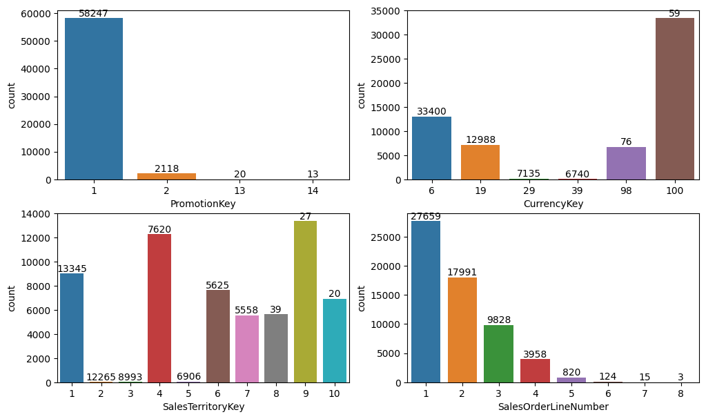
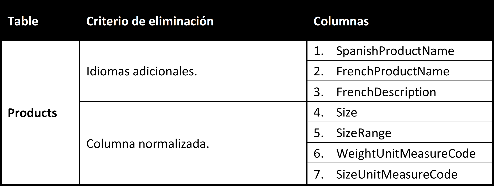
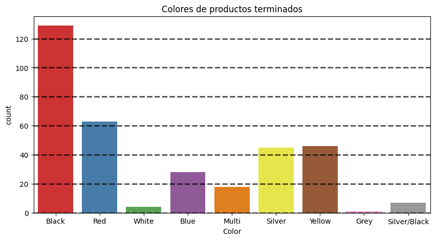

# Database-project
Creación de la base de datos en SQL Server, partiendo del análisis exploratorio de datos de ventas, clientes, productos, promociones y divisa.

Datos principales: 
* SALES
* CUSTOMERt
* PRODUCTSt

Datos de apoyo:
* PROMOTION
* CURRENCY

## Modificaciones en tabla sales:
* Se eliminan las columnas sin datos (CarrierTrackingNumber, CustomerPONumber) y las "llaves" de fechas (YYYYMMDD).
* Se remueven las columnas para las que se repite un mismo valor en todas las filas.

<p align="left">


</p>

```
sales_cp = sales.copy()
# Se verifica que ninguna fecha tenga problemasde formato.
sales_cp['OrderDate'] = pd.to_datetime(sales_cp['OrderDate'], format='%Y-%m-%d %H:%M:%S')
sales_cp['DueDate'] = pd.to_datetime(sales_cp['DueDate'], format='%Y-%m-%d %H:%M:%S')
sales_cp['ShipDate'] = pd.to_datetime(sales_cp['ShipDate'], format='%Y-%m-%d %H:%M:%S')
# Se eliminan las columnas sin datos y las llaves de fechas.
sales_cp.drop(columns=['OrderDateKey', 'DueDateKey', 'ShipDateKey', \
        'SalesTerritoryKey', 'RevisionNumber', 'OrderQuantity', \
        'UnitPriceDiscountPct', 'DiscountAmount', 'CarrierTrackingNumber', \
        'CustomerPONumber'], inplace = True)
# Guardamos los datos limpios.
sales_cp.to_csv(myPath+'cleaned/SALES_clean.csv', encoding='latin-1', index=False)
```

## Modificaciones en tabla customers:
* Columna Phone en formato 10 dígitos seguidos.
* Commute Distance se divide en min y max.
* Eliminación de la columna NameStyle, que contiene un solo registro repetido en todas las columnas.
* Eliminación de las columnas: Title, que contiene colamente 101 registros, Suffix, con 3 registros y AddressLine2, con 312. Considerando que el total de registros es de 18485, estas columnas tienen un porcentaje de datos del 0.54, 0.016 y 1.7%, respectivamente, por lo que las columnas no generarán conocimientos de interés y se eliminarán.

<p align="left">

</p>

```
cust_cp = cust.copy()
cust_cp['BirthDate'] = pd.to_datetime(cust_cp['BirthDate'], format='%Y-%m-%d')
cust_cp['DateFirstPurchase'] = pd.to_datetime(cust_cp['DateFirstPurchase'], format='%Y-%m-%d')
# Se eliminan las columnas sin datos y los nombres en otros idiomas.
cust_cp.drop(columns=['GeographyKey', 'CustomerAlternateKey', 'Title', 'NameStyle', \
    'Suffix', 'SpanishEducation', 'FrenchEducation','SpanishOccupation', 'FrenchOccupation',\
          'AddressLine2'], inplace = True)
cust_cp['Phone'] = cust_cp['Phone'].replace({' ':'', '-': ''}, regex=True).str[-10:].astype(int)
# cust_cp['CommuteDistance'] = cust_cp['CommuteDistance'].\
# replace({' ':'', 'Miles': '', '10\+':'10-'}, regex=True)
# cust_cp[['CommuteDistanceMin','CommuteDistanceMax']] = cust_cp['CommuteDistance'].str.split("-", expand = True)
cust_cp[['CommuteDistanceMin','CommuteDistanceMax']] = cust_cp['CommuteDistance'].\
replace({' ':'', 'Miles': '', '10\+':'10-'}, regex=True).str.split("-", expand = True)
cust_cp['CommuteDistanceMin'] = pd.to_numeric(cust_cp['CommuteDistanceMin'], errors='coerce', downcast='integer')
cust_cp['CommuteDistanceMax'] = pd.to_numeric(cust_cp['CommuteDistanceMax'], errors='coerce', downcast='integer')
cust_cp.drop(columns='CommuteDistance', inplace = True)
# Exportamos los datos
cust_cp.to_csv(myPath+'cleaned/CUSTOMERS_clean.csv', encoding='latin-1', index=False)
```

## Modificaciones en la tabla products
<p align="left">


</p>

```
products_clean_1=products.copy()
#Eliminamos SizeRange y Size
products_clean_1.drop(columns=['SizeRange','Size'],inplace=True)
#agrergamos las columnas de SizeLetter y SizeNumber 
products_clean_1['SizeClothes']=size_letter
products_clean_1['SizeParts']=size_number
products_clean_1['SizeParts']=products_clean_1['SizeParts'].replace('',np.nan)
products_clean_1['SizeClothes']=products_clean_1['SizeClothes'].replace('',np.nan)
#Ahora eliminamos las columnas que no aportan relevancia a nuestro estudio
products_clean_1.drop(columns=['FrenchDescription','SpanishProductName', \
'FrenchProductName','WeightUnitMeasureCode','SizeUnitMeasureCode'],inplace = True)
```
